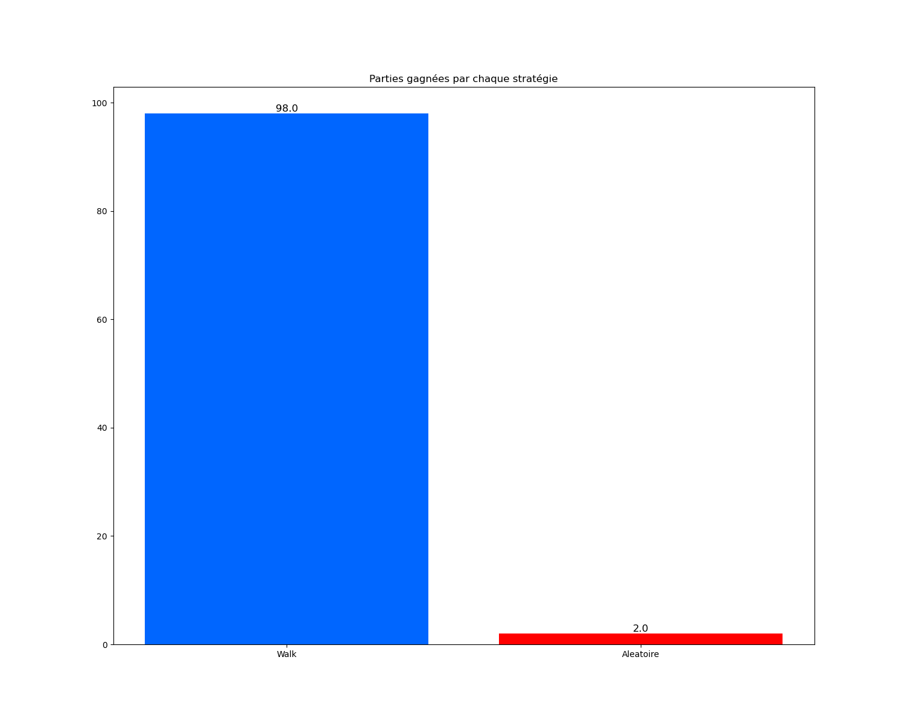

# projet-quoridor
Projet IA et Jeux 2022-2023, L3 Sorbonne Université

## Présentation générale du projet

On propose dans ce projet d'implémenter une version librement inspirée du jeu Quoridor.
Le principe général du jeu est le suivant: chaque joueur cherche à être le premier à traverser le terrain.
Chaque joueur jour à tour de rôle. Les coups possibles sont:
* le déplacement de son joueur,
* le dépôt d'un mur de 2 cases sur le plateau.

Les règles de déplacement sont les suivantes:
* il est possible de se déplacer de une case, dans toutes les directions sauf les diagonales. On suppose ici que les joueurs ne se bloquent pas entre eux, et qu'ils peuvent éventuellement être sur la même case à un moment donné.

Les règles de placement sont les suivantes:
* les murs sont constitués de 2 "briques" (2 cases) qui doivent posés côte-à-côte horizontalement ou verticalement
* les murs sont ici posés sur les cases (et non entre elles comme c'est le cas dans le jeu de Quridor classique),
* il est interdit de poser des murs sur les lignes où sont placés initialement les joueurs
* il est interdit de déposer un mur à un endroit qui fermerait tout chemin d'un des autres joueurs vers ses objectifs.

# Rapport de projet

## Groupe 3

- Tarek Yacine ATBI
- Ousmane CISSE

## Description des choix importants d'implémentation

Pour implémenter les stratégies de jeu pour le jeu Quoridor en Python, plusieurs choix d'implémentation ont été nécessaires. Tout d'abord, il a été décidé d'utiliser une implémentation en fonctions pour faciliter la réutilisation du code et permettre une modularité optimale. Les fonctions implémentées ont été divisées en trois catégories principales : les fonctions de configuration du jeu (dèja donné), les fonctions de manipulation du plateau de jeu (modifié par nous) et les fonctions de stratégies de jeu (donné par nous).

Les fonctions de stratégies de jeu ont été utilisées pour implémenter les différentes stratégies de jeu, telles que la stratégie stochastique, titFortat et BlockIt.

En outre, il a été décidé d'utiliser des structures de données telles que les listes et les dictionnaires pour stocker les informations nécessaires sur l'état du jeu, les joueurs et les murs. Cela a permis une manipulation facile et efficace des données dans le cadre du jeu.

En somme, ces choix d'implémentation ont permis d'implémenter efficacement les stratégies de jeu pour le jeu Quoridor en Python tout en favorisant la modularité et la réutilisation du code.

Il est important de noter qu'il existe deux types de jeu disponibles dans Quoridor, qui ont tous deux été pris en compte dans l'implémentation des stratégies de jeu. Le premier type de jeu consiste à atteindre un objectif exacte, c'est-à-dire une case précise sur le plateau de jeu. Le deuxième type de jeu consiste à atteindre n'importe quelle case de la ligne de départ de l'adversaire.

-type 0: le joueur gagne en arrivant sur une case précise de la ligne d'arrivée

-type 1: le joueur gagne dès qu'il arrive à une case de la ligne d'arrivée

## Description des stratégies proposées

### Stratégie aléatoire

La première stratégie implémentée est la stratégie aléatoire. Cette stratégie consiste à choisir un mouvement au hasard parmi les mouvements possibles. Elle est utile pour tester la robustesse des autres stratégies, ainsi que pour avoir une base de comparaison pour les autres stratégies.

### Stratégie stochastique

La deuxième stratégie implémentée est la stratégie stochastique. Cette stratégie est similaire à la stratégie aléatoire, sauf qu'elle utilise une distribution de probabilité pour choisir le mouvement à effectuer. Les mouvements ayant une probabilité plus élevée d'être utiles sont plus susceptibles d'être choisis. Cela permet d'augmenter les chances de succès de la stratégie, tout en maintenant une certaine variabilité.

### Stratégie walk

La troisième stratégie implémentée est la stratégie "walk". Cette stratégie consiste simplement à déplacer le joueur sans poser de murs. Elle est particulièrement utile dans les situations où l'objectif est proche, ou lorsque le joueur n'a plus de murs à sa disposition. Cette stratégie peut être utilisée pour effectuer des mouvements rapides et sûrs.

### Stratégie titFortat

La quatrième stratégie implémentée est la stratégie "TitFortat". Cette stratégie est basée sur la théorie du jeu du même nom. Elle consiste à ne poser un mur que si l'adversaire en a posé un au tour précédent. Cela permet de maximiser l'utilisation des murs tout en minimisant le risque de gaspiller les murs. Cette stratégie peut être très efficace dans les situations où les joueurs ont un nombre limité de murs à leur disposition.

### Stratégie BlockIt

La cinquième et dernière stratégie est la stratégie Block It. Cette stratégie consiste à s'adapter aux coups de l'adversaire en bloquant (d'ou son nom) les mouvements de l'adversaire à chaque fois qu'il bouge. Voici son fonctionnement : 
  -	Quand l'adversaire place un mur, le joueur avance d’une case avec A*
  -	Quand l'adversaire se déplace, le joueur place un mur sur la prochaine case que jouera l'adversaire avec A*.

## Description des résultats

Comparaison entre les stratégies. Bien indiquer les cartes utilisées.

### Walk vs Aleatoire

Pour ce test nous avons fait jouer `walk` en J1 contre `Aléatoire`en J2.
Voilà nos résultats:

On remarque que `walk` bat `Aleatoire` à plate couture. Ce qui n'est pas vraiment une grande surprise sachant que walk se concentre seulement sur le mouvement que sur les murs, on a aussi remarqué que parfois le J2 se trouve bloquer par ses propres murs.

### Aleatoire vs TitForTat

On remarque que TitFortat et Aleatoire ont des reultats très proches mais TitForThat prend la victoire.

### Walk vs Stochastique

On voit encore une fois l'efficacité de la simplicité de l'algorithme de walk contre un algorithme stochastique.

### Stochastique vs Aleatoire

Stochastique est un version plus sophistiquée de la stratégie aléatoire, elle prend en compte les mouvements et les poses de murs de manière équilibrée, elle est capable de s'adapter aux mouvements de l'adversaire et de réagir en conséquence.

### BlockIt vs Aleatoire

On remarque que la stratégie BlockIt gagne légerment contre aléatorie.

### BlockIt vs Walk

La stratégie walk encore une fois gagne avec efficacité par le fait qu'elle se concentre sur le mouvement, par contre blockIt en essayant de la bloquer se bloque soi meme en plus du fait qu'on peut pas bloquer toute la ligne.

### BlockIt vs Stochastique

BlockIt perd contre stochastique.

### BlockIt vs TitForTat

BlockIt perd légérement contre titFortat.

## Stratégie BlockIt

## Extension de la stratégie BlockIt

## Tableau de comparaison

